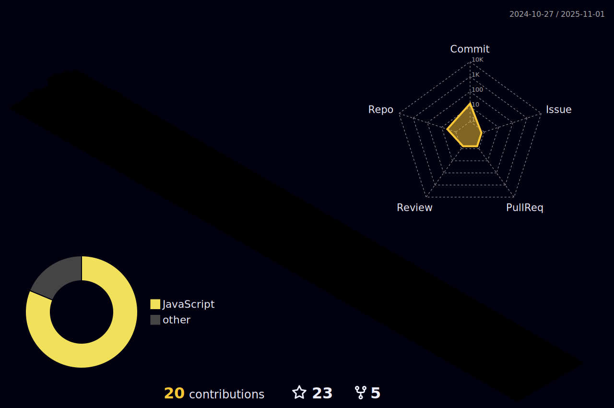

# Hi there, I'm E-Ro Nguyen 👋
- I am currently a CS Ph.D. student at Stony Brook University. 
- I earned a Bachelor's degree in Computer Science in the APCS at the University of Science, VNU-HCM.
- My website: https://eronguyen.me/

### Connect with me:
[][facebook]
[][linkedin] 

---

---

 
### Languages and tools:

 

---

[][my_github]
[][my_github]

<!--
**nero1342/nero1342** is a ✨ _special_ ✨ repository because its `README.md` (this file) appears on your GitHub profile.

Here are some ideas to get you started:

- 🔭 I’m currently working on ...
- 🌱 I’m currently learning ...
- 👯 I’m looking to collaborate on ...
- 🤔 I’m looking for help with ...
- 💬 Ask me about ...
- 📫 How to reach me: ...
- 😄 Pronouns: ...
- ⚡ Fun fact: ...
-->

[facebook]:https://www.facebook.com/nicky.rio/
[linkedin]:https://www.linkedin.com/in/nero1342/
[my_github]:https://github.com/nero1342
